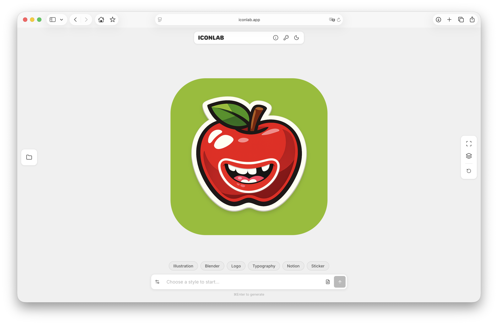

# Icon Lab

AI-powered app icon generator. Describe your icon, pick a style, and get production-ready assets in seconds.

**[iconlab.app](https://iconlab.app)**



## Features

- Generate app icons from text prompts using OpenAI GPT Image
- Multiple style presets (Illustration, Blender, Logo, Typography, Notion, Sticker, and more)
- Semantic style axes — control volume, color, shape, detail, and text presence
- Optional materials (glass, wood, metal, etc.)
- Layer editor — compose up to 5 layers with transforms, tint, opacity, and drop shadow
- Customizable backgrounds (solid, gradient, mesh, transparent)
- Export production-ready ZIP with all iOS/macOS icon sizes
- Gallery with IndexedDB persistence
- Dark mode

## Usage

Icon Lab runs entirely in the browser — no backend, no build step. You need an [OpenAI API key](https://platform.openai.com/api-keys) with access to the GPT Image model.

1. Visit [iconlab.app](https://iconlab.app) or serve locally:
   ```bash
   npx serve .
   ```
2. Enter your OpenAI API key in Settings
3. Pick a style, describe your icon, generate

## Tech Stack

Vanilla JavaScript, no framework, no bundler. Scripts loaded via `<script>` tags in strict order on a global `App` namespace.

## License

[MIT](LICENSE)

## Contributing

This is a personal project and is not accepting contributions at this time.
